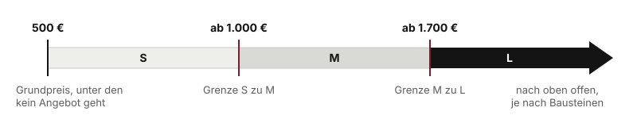
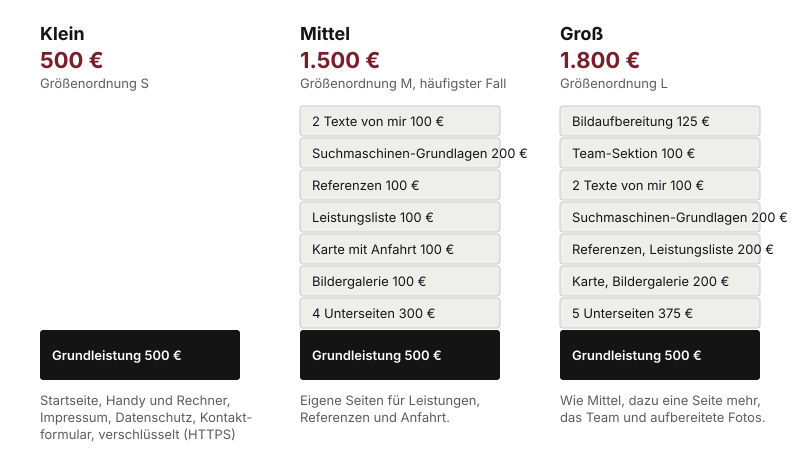

# Was eine Website bei dekaru ist

Es gibt keine Pakete mehr. Seit dem 24.08.2026 entsteht jeder Preis aus dem **Preisrechner** auf dekaru.de: ein Grundpreis plus die Bausteine, die der Betrieb braucht. Was der Rechner ausgibt, ist der Preis. Nicht mehr, nicht weniger, kein Nachlass.

## Der Grundpreis: 500 €

Unter 500 € geht kein Angebot. Darin steckt alles, was jede Website braucht:

- Startseite
- Darstellung auf Handy, Tablet und Rechner
- Impressum und Datenschutzerklärung
- Kontaktformular mit Einwilligung
- Verschlüsselte Verbindung (HTTPS)

Eine Seite für 500 € ist eine einzelne, gut gemachte Startseite. Für einen Betrieb, der vor allem gefunden werden und erreichbar sein will, reicht das oft.

## Die Bausteine

Alles darüber hinaus ist ein Baustein mit festem Preis. Die vollständige Liste steht im Anhang (Kapitel 11). Die wichtigsten:

| Baustein | Preis | Was es ist |
|---|---|---|
| Unterseite | 75 € je Seite | Leistungen, Über uns, Anfahrt, Kontakt |
| Bildergalerie | 100 € | Bilder im Raster, auf Wunsch mit Großansicht |
| Karte mit Anfahrt | 100 € | Lädt erst nach Zustimmung, DSGVO-fest |
| Leistungs- oder Speisekarte | 100 € | Liste mit Preisen und Beschreibungen |
| Team-Sektion | 100 € | Personen mit Bild und Funktion |
| Referenzen und Bewertungen | 100 € | Kundenstimmen, gepflegt oder aus Google |
| Ratgeber-Bereich | 300 € | Eigener Bereich für Beiträge |
| Terminanfrage | 125 € | Formular mit Wunschtermin, Antwort per Mail |
| Texte von mir | 50 € je Seite | Statt dass der Kunde Texte liefert |
| Bildaufbereitung | 125 € | Bis 20 vorhandene Bilder zuschneiden und optimieren |
| Logo-Entwurf | 250 € | Nur falls noch keines vorhanden ist |
| Suchmaschinen-Grundlagen | 200 € | Titel, Beschreibungen, lokale Auszeichnung |

**Individuelles Feature:** alles, was nicht auf der Liste steht. Dafür gibt es keinen Listenpreis. Den nenne nur ich, nach Rücksprache, und es kommt als Nachtrag ins Angebot. Sie sagen dazu: "Das klärt Herr Henning mit Ihnen."

## Die drei Größenordnungen

Die alten Pakete S, M und L leben nur noch als Einordnung weiter. Die Grenzen kommen aus dem Preisrechner:

| Größe | Preis | Typischer Umfang |
|---|---|---|
| S | unter 1.000 € | Startseite, ein bis drei Bausteine |
| M | ab 1.000 € | mehrere Unterseiten, Galerie, Karte, Suchmaschinen-Grundlagen |
| L | ab 1.700 € | wie M, dazu Team, Bildaufbereitung, weitere Funktionen |

Die Grenzen dienen nur dem Gespräch untereinander. Dem Kunden gegenüber gibt es keine Größen, nur seine Bausteine und seine Summe.

## Was die günstigste von der teuersten Website unterscheidet

Der Preisrechner hat drei Voreinstellungen, die ich im Gespräch zeige: **Klein, Mittel und Groß.** Sie sind keine Pakete, sondern Startpunkte. Ein Klick setzt die Schalter, danach lässt sich alles anpassen.

Der Unterschied liegt in drei Dingen:

1. **Umfang.** Klein ist eine Seite. Mittel hat vier Unterseiten, Groß fünf. Jede Unterseite ist eine Seite mehr, die geschrieben, gestaltet und gepflegt wird.
2. **Sektionen.** Galerie, Karte, Leistungsliste, Referenzen, bei Groß auch das Team. Jede Sektion ist ein Block auf der Seite mit eigener Gestaltung.
3. **Arbeit an den Inhalten.** Texte von mir, aufbereitete Bilder, Suchmaschinen-Grundlagen. Das ist Arbeitszeit, die der Betrieb sonst selbst investieren müsste.

Was nicht teurer wird: die Machart. Die Seite für 500 € ist genauso auf dem Handy gebaut, genauso barrierefrei und genauso DSGVO-fest wie die für 1.800 €.

## Drei Beispielrechnungen

Alle Zahlen aus dem Preisrechner, Stand 01.10.2026.

**Beispiel 1: Café, Größenordnung S**

| Position | Preis |
|---|---|
| Grundpreis | 500 € |
| Speisekarte | 100 € |
| Karte mit Anfahrt | 100 € |
| Bildergalerie | 100 € |
| 1 Unterseite (Über uns) | 75 € |
| 1 Text von mir | 50 € |
| **Summe** | **925 €** |

**Beispiel 2: Friseursalon, Größenordnung M**

| Position | Preis |
|---|---|
| Grundpreis | 500 € |
| 2 Unterseiten (Leistungen, Team) | 150 € |
| Bildergalerie | 100 € |
| Terminanfrage | 125 € |
| Bildaufbereitung | 125 € |
| **Summe** | **1.000 €** |

**Beispiel 3: Handwerksbetrieb, Größenordnung L**

| Position | Preis |
|---|---|
| Voreinstellung Groß (5 Unterseiten, Galerie, Karte, Leistungsliste, Referenzen, Team, Suchmaschinen-Grundlagen, 2 Texte, Bildaufbereitung) | 1.800 € |
| Ratgeber-Bereich | 300 € |
| **Summe** | **2.100 €** |

Die Voreinstellungen selbst: Klein 500 €, Mittel 1.500 €, Groß 1.800 €.

## Suchmaschinen-Grundlagen und Google-Profil: nicht dasselbe

Beides klingt nach "bei Google gefunden werden", und Kunden fragen, ob sie doppelt zahlen. Sie zahlen nicht doppelt:

- **Suchmaschinen-Grundlagen, 200 €**, sind Arbeit **an der Website**: Seitentitel, Beschreibungen, die in der Suche erscheinen, und die technische Auszeichnung, mit der Google den Betrieb als lokales Unternehmen versteht. Dazu gehört, dass die Website mit dem Google-Eintrag verknüpft ist.
- **Das Google-Unternehmensprofil, 249 € oder 490 €**, ist Arbeit **am Eintrag bei Google Maps**: anlegen oder übernehmen, Öffnungszeiten, Kategorien, Fotos, Beiträge. Das ist ein eigener Kanal, der auch ohne Website funktioniert (Kapitel 5).

Das eine macht die Website auffindbar, das andere den Betrieb auf der Karte sichtbar.

## Was immer dazugehört, aber nicht im Preis steckt

- **Hosting** ist getrennt vom einmaligen Website-Preis und optional. Kapitel 3.
- **Domain:** wird auf den Namen des Kunden registriert. Im Hosting sind die laufenden Domainkosten bis 15 € im Jahr enthalten.
- **Zahlung:** die Hälfte bei Auftrag, der Rest bei Übergabe. Davon wird nicht abgewichen.
- **Eine Korrekturrunde** nach der Vorstellung der fertigen Seite gehört zum Werkvertrag. Was danach kommt, läuft über das Hosting-Kontingent.
