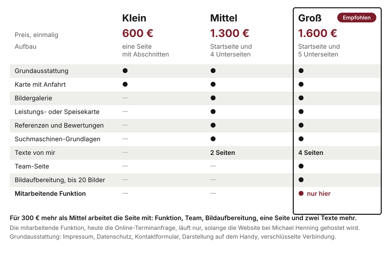

# Was eine Website bei dekaru ist

Seit dem 01.10.2026 gibt es drei feste Pakete: **Klein, Mittel und Groß.** Jedes hat einen festen Preis und einen festen Inhalt. Was ein Betrieb darüber hinaus braucht, kommt als Zusatzbaustein dazu, ebenfalls zu einem festen Preis. Paket plus Bausteine ist der Preis. Nicht mehr, nicht weniger, kein Nachlass.

Am Telefon und im Erstgespräch heißt es weiterhin nur: **"ab 600 €".** Die Pakete und ihre Preise kommen erst im Zweittermin auf den Tisch.

## Die drei Pakete

| | Klein | Mittel | Groß |
|---|---|---|---|
| Preis | **600 €** | **1.300 €** | **1.600 €** |
| Aufbau | eine Seite mit Abschnitten | Startseite und 4 Unterseiten | Startseite und 5 Unterseiten |
| Impressum, Datenschutz, Kontaktformular, Handy, Verschlüsselung | ja | ja | ja |
| Karte mit Anfahrt (Zwei-Klick) | ja | ja | ja |
| Bildergalerie | | ja | ja |
| Leistungs- oder Speisekarte | | ja | ja |
| Referenzen und Bewertungen | | ja | ja |
| Suchmaschinen-Grundlagen | | ja | ja |
| Texte von mir | | 2 Seiten | 4 Seiten |
| Team-Seite | | | ja |
| Bildaufbereitung (bis 20 Bilder) | | | ja |
| **Mitarbeitende Funktion** | | | **ja, nur hier** |

Groß trägt auf dekaru.de das Zeichen "Empfohlen".

**Wer was bekommt, in einem Satz je Paket:**

- **Klein** ist für den Betrieb, der vor allem gefunden werden und erreichbar sein will. Eine gut gemachte Seite mit allem Nötigen und der Anfahrt.
- **Mittel** ist für den Betrieb, der zeigen will, was er kann: eigene Seiten für Leistungen und Referenzen, Bilder, Texte von mir, gut auffindbar bei Google.
- **Groß** ist für den Betrieb, dem die Website auch Arbeit abnehmen soll. Alles aus Mittel, dazu das Team, aufbereitete Fotos, mehr Seiten und Texte und die mitarbeitende Funktion.

Was nicht teurer wird: die Machart. Klein ist genauso auf dem Handy gebaut, genauso barrierefrei und genauso DSGVO-fest wie Groß.

## Die mitarbeitende Funktion, nur in Groß

Die Website nimmt dem Betrieb eine Aufgabe ab. **Heute ist das die Online-Terminanfrage:** ein Formular mit Wunschtermin, die Anfrage kommt per Mail beim Betrieb an. Geplant sind je Branche Reservierung (Gastro), Terminbuchung (Friseur, Praxis) und Anfrage mit Foto-Upload (Handwerk). Geplant heißt: nicht versprochen. Verkauft wird, was es heute gibt.

Drei Regeln, die Sie kennen müssen:

1. **Nur in Groß.** Die Funktion lässt sich nicht als Baustein zu Klein oder Mittel dazukaufen.
2. **Nur mit Hosting bei mir.** Der Dienst, der die Anfragen verarbeitet, läuft bei mir. Die Funktion läuft deshalb, solange die Website bei mir gehostet wird, egal in welcher Hosting-Stufe.
3. **Endet das Hosting, entfällt die Funktion.** Die Website bleibt, das Formular für die Terminanfrage nicht. Das sagen Sie dem Betrieb vorher, nicht hinterher.

## Warum Groß meist die beste Wahl ist

Das ist der Teil, den Sie im Zweittermin brauchen. In einfachen Worten:

**Mittel ist der Vergleichspunkt.** Wer sich Mittel ansieht, hat entschieden, dass er mehr will als eine einzelne Seite. Einzeln gerechnet stecken in Mittel rund 1.500 €, das Paket kostet 1.300 €.

**Groß kostet nur 300 € mehr.** Dafür kommt sichtbar viel dazu: die Funktion, die Team-Seite, die Bildaufbereitung, eine Seite und zwei Texte mehr. Die Bausteine allein wären rund 400 € wert, dazu kommt die Funktion, die es einzeln gar nicht gibt. Der Satz dazu:

> "Für 300 € mehr arbeitet die Seite mit. Sie nimmt Ihnen Terminanfragen ab, auch abends und am Wochenende, wenn bei Ihnen keiner ans Telefon geht."

**Warum das für den Betrieb stimmt.** Die meisten Betriebe vergleichen nicht drei Pakete, sondern zwei: das, was sie eigentlich wollten, und das nächstgrößere. Liegt das größere nur ein kleines Stück darüber und bringt etwas, das das kleinere gar nicht kann, ist die Entscheidung leicht. Das ist kein Trick, sondern ein ehrlicher Preisabstand.

**Was Sie offen dazusagen.** Die Funktion hängt am Hosting bei mir. Wer Groß nimmt und später selbst hosten will, verliert die Funktion. Das sagen Sie im selben Atemzug. Für die meisten Betriebe ist das keine Hürde, weil sie ohnehin nicht selbst hosten wollen.

**Wann Klein oder Mittel richtig ist.** Wenn ein Betrieb wirklich nur eine Visitenkarte im Netz braucht, ist Klein richtig, und dann sagen Sie das auch. Wer keine Termine vergibt und kein Team zeigen will, ist mit Mittel gut bedient. Niemand wird in Groß geredet. Ein Kunde, der sich überredet fühlt, kündigt das Hosting im ersten Jahr.

## Zusatzbausteine, zu jedem Paket

Was ein Paket nicht schon enthält, lässt sich als Baustein dazubuchen. Ein Baustein, der im Paket schon steckt, wird nicht noch einmal verkauft: Mittel bekommt keine Bildergalerie dazu, Groß keine Team-Seite.

| Baustein | Preis |
|---|---|
| Weitere Unterseite | 75 € je Seite |
| Bildergalerie | 100 € |
| Leistungs- oder Speisekarte | 100 € |
| Team-Seite | 100 € |
| Referenzen und Bewertungen | 100 € |
| Ratgeber-Bereich | 300 € |
| Newsletter-Anmeldung | 150 € |
| Besucherstatistik ohne Cookies | 90 € |
| Weitere Sprache | 200 € je Sprache |
| Texte von mir | 50 € je Seite |
| Bildaufbereitung | 125 € |
| Logo-Entwurf | 250 € |
| Suchmaschinen-Grundlagen | 200 € |
| Individuelles Feature | auf Anfrage |

Die Karte mit Anfahrt ist in allen Paketen enthalten und deshalb kein Baustein. **Nicht als Baustein buchbar ist die mitarbeitende Funktion.** Den früheren Baustein "Terminanfrage" für 125 € gibt es nicht mehr.

**Individuelles Feature:** alles, was nicht auf der Liste steht. Dafür gibt es keinen Listenpreis. Den nenne nur ich, nach Rücksprache, und es kommt als Nachtrag ins Angebot. Sie sagen dazu: "Das klärt Herr Henning mit Ihnen."

## Drei Beispielrechnungen

Stand 01.10.2026.

**Beispiel 1: Café, Paket Klein**

| Position | Preis |
|---|---|
| Paket Klein | 600 € |
| Speisekarte | 100 € |
| Bildergalerie | 100 € |
| **Summe** | **800 €** |

**Beispiel 2: Steuerberatung, Paket Mittel**

| Position | Preis |
|---|---|
| Paket Mittel | 1.300 € |
| Team-Seite | 100 € |
| **Summe** | **1.400 €** |

**Beispiel 3: Friseursalon, Paket Groß**

| Position | Preis |
|---|---|
| Paket Groß, mit Online-Terminanfrage | 1.600 € |
| Logo-Entwurf | 250 € |
| **Summe** | **1.850 €** |

Beim Friseursalon in Beispiel 3 läuft die Terminanfrage, solange er bei mir hostet.

## Suchmaschinen-Grundlagen und Google-Profil: nicht dasselbe

Beides klingt nach "bei Google gefunden werden", und Kunden fragen, ob sie doppelt zahlen. Sie zahlen nicht doppelt:

- **Suchmaschinen-Grundlagen**, in Mittel und Groß enthalten, zu Klein für 200 € dazubuchbar, sind Arbeit **an der Website**: Seitentitel, Beschreibungen, die in der Suche erscheinen, und die technische Auszeichnung für Google. Dazu gehört, dass die Website mit dem Google-Eintrag verknüpft ist.
- **Das Google-Unternehmensprofil, 249 € oder 490 €**, ist Arbeit **am Eintrag bei Google Maps**: anlegen oder übernehmen, Öffnungszeiten, Kategorien, Fotos, Beiträge. Das ist ein eigener Kanal, der auch ohne Website funktioniert (Kapitel 5).

Das eine macht die Website auffindbar, das andere den Betrieb auf der Karte sichtbar.

## Software-Module: etwas anderes als die Funktion

Neben Paketen und Bausteinen gibt es Software-Module, einzeln gekauft, mit eigenem Einmalpreis (Kapitel 12). Heute verkaufbar ist der **Kostenrechner**: Besucher rechnen sich einen unverbindlichen Richtwert aus und schicken ihn mit der Anfrage. Ein Modul ist nicht die mitarbeitende Funktion, und die Funktion ist kein Modul. Angeboten wird nur, was unter Verkaufshilfen im Portal steht.

## Was immer dazugehört, aber nicht im Preis steckt

- **Hosting** ist getrennt vom einmaligen Website-Preis und optional. Kapitel 3. Bei Groß ist es die Voraussetzung dafür, dass die Funktion läuft.
- **Domain:** wird auf den Namen des Kunden registriert. Im Hosting sind die laufenden Domainkosten bis 15 € im Jahr enthalten.
- **Zahlung:** die Hälfte bei Auftrag, der Rest bei Übergabe. Davon wird nicht abgewichen.
- **Eine Korrekturrunde** nach der Vorstellung der fertigen Seite gehört zum Werkvertrag. Was danach kommt, läuft über das Hosting-Kontingent.
