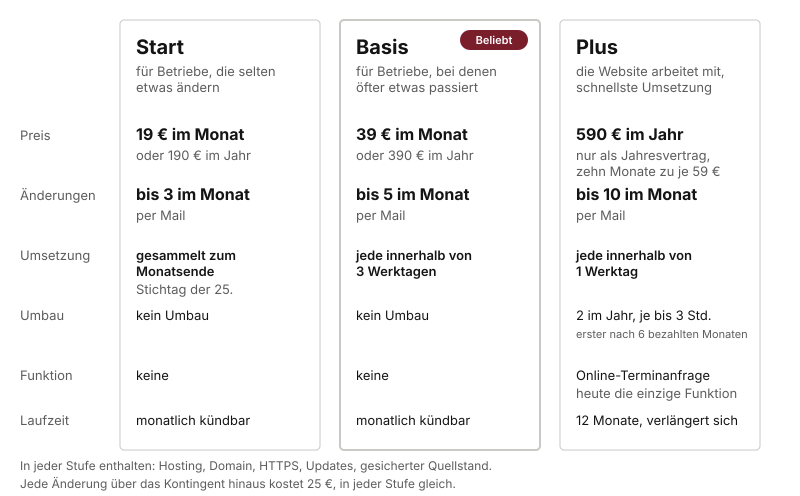
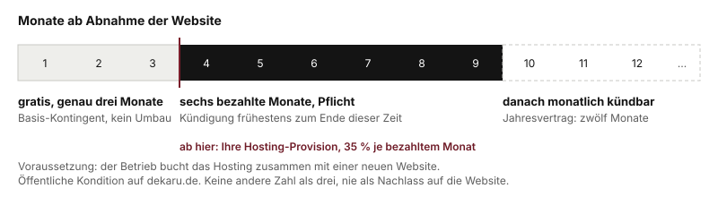

# Hosting und Pflege

Hosting heißt: ich betreibe die Website für den Betrieb und pflege sie. Es ist getrennt vom einmaligen Website-Preis und optional. Ein Betrieb kann die Seite auch selbst hosten. Die meisten wollen das nicht, weil sie dann Domain, Server, Updates und jede Änderung selbst in der Hand haben.

Stand der Konditionen: entschieden am 29.09.2026. Der Betreuungsvertrag, den der Kunde dazu unterschreibt, ist ein Entwurf, der noch anwaltlich geprüft wird. Die Zahlen hier sind die, die gelten.

## Die drei Stufen

| | Start | Basis | Plus |
|---|---|---|---|
| Monatlich | 19 € | 39 € | nicht möglich |
| Jährlich | 190 € | 390 € | 590 € |
| Änderungen per Mail | bis 3 im Monat | bis 5 im Monat | bis 10 im Monat |
| Umsetzung | gesammelt zum Monatsende, Stichtag der 25. | innerhalb von 3 Werktagen | innerhalb von 1 Werktag |
| Umbau | nein | nein | 2 im Jahr |
| Mitarbeitende Funktion | nein | nein | Online-Terminanfrage |
| Laufzeit | monatlich kündbar | monatlich kündbar | nur Jahresvertrag |

Plus: 590 € im Jahr, nur als Jahresvertrag. Das sind zehn berechnete Monate zu je 59 €.

Basis trägt auf der Website das "Beliebt"-Zeichen. Es ist die Stufe für Betriebe, bei denen öfter etwas passiert, die aber keinen Umbau brauchen.

## Was in jeder Stufe steckt

Egal welche Stufe, das ist immer dabei:

- **Hosting**, also der Betrieb der Website bei einem Hosting-Anbieter, weltweit schnell ausgeliefert.
- **Domain.** Sie wird auf den Namen des Kunden registriert und gehört ihm. Laufende Kosten bis 15 € im Jahr sind enthalten.
- **Verschlüsselte Auslieferung** über HTTPS.
- **Technische Aktualisierung** der Bausteine, soweit sie für Sicherheit und Betrieb nötig ist.
- **Gesicherter Quellstand.** Jede Version der Website ist gesichert und lässt sich jederzeit vollständig neu bereitstellen. Sagen Sie **nicht "Backups"**. Es gibt keine laufende Serversicherung, weil die Website selbst keine Daten auf dem Server speichert. Der gesicherte Quellstand ist gleichwertig, und so steht es im Vertrag.
- **Änderungen** im Umfang der Stufe, Kapitel 4.

## Was das teurere Hosting teurer macht

Der Preisunterschied ist keine Marge, sondern Arbeitszeit. Vier Dinge unterscheiden die Stufen:

1. **Arbeitszeit.** Drei, fünf oder zehn Änderungen im Monat. Eine Änderung kostet mich mit Mail, Umsetzung, Vorschau und Freigabe realistisch 15 bis 20 Minuten. Zehn davon sind ein halber Arbeitstag, jeden Monat.
2. **Reaktionszeit.** Bei Start sammle ich und setze einmal im Monat um. Das ist der Grund, warum Start günstig bleibt. Basis heißt drei Werktage, Plus heißt ein Werktag. Je kürzer, desto öfter muss ich meine Planung unterbrechen.
3. **Umbauten.** Nur bei Plus: zwei im Jahr, jeder bis zu drei Stunden Arbeit, zum Beispiel ein Bereich neu gestaltet. Der erste frühestens nach sechs bezahlten Monaten, danach einer je Halbjahr. Nicht genutzte Umbauten verfallen. Diese Grenzen sind nicht verhandelbar, weil die Rechnung bei 590 € sonst nicht aufgeht.
4. **Eine Funktion, die mitarbeitet.** Nur bei Plus: die Website nimmt dem Betrieb eine Aufgabe ab. **Heute ist das die Online-Terminanfrage**, ein Formular mit Wunschtermin und Rückmeldung per Mail. Ohne Plus kostet dieser Baustein 125 € einmalig. Mehr gibt es derzeit nicht: keine Tischreservierung, keine Terminbuchung mit Kalender. Das ist geplant, aber nicht versprochen.

## Was es noch nicht gibt

**Ein Redaktionssystem zum Selbst-Ändern gibt es noch nicht.** Der Kunde kann seine Öffnungszeiten nicht selbst eintragen. Er schreibt mir, und ich ändere. Das Redaktionssystem ist das nächste Produkt, das ich baue, und bis es steht, wird es nicht versprochen. Nicht am Telefon, nicht im Termin, nicht als "kommt bald".

Wenn ein Kunde fragt:

> "Im Moment schicken Sie ihm die Änderung per Mail, und er setzt sie um, das ist in jeder Stufe drin. Ein System, in dem Sie selbst ändern, ist in Arbeit. Wann es kommt, kann ich Ihnen nicht zusagen."

## Werktage und Urlaub

Alle Zeiten sind Werktage: Montag bis Freitag ohne die gesetzlichen Feiertage in Baden-Württemberg. Die Zeit läuft ab Eingang des vollständigen Änderungswunsches. Urlaub kündige ich vorher an, und in der Abwesenheit ruht die Zeit. Ich bin allein, und eine Zusage, die im ersten Urlaub bricht, kostet mehr als ein ehrlicher Satz.

## Jahreszahlung: zehn bezahlt, zwölf erhalten

Wer für zwölf Monate im Voraus zahlt, zahlt zehn Monatsbeträge. Das ergibt 190 € für Start, 390 € für Basis und 590 € für Plus. Die Laufzeit beträgt dann zwölf Monate und verlängert sich um weitere zwölf, wenn nicht einen Monat vor Ablauf gekündigt wird. Plus gibt es nur so.

Bei monatlicher Zahlung gibt es keine Mindestlaufzeit, die Kündigungsfrist ist ein Monat zum Monatsende. Ausnahme: das Gratisquartal.

## Das Gratisquartal

Das ist der eine Vorteil, den Sie im Termin zusagen dürfen. Genau so und nicht anders:

- **Genau drei Monate Hosting gratis.** Nicht "bis zu", nicht zwei, nicht vier.
- **Nur zusammen mit einer neuen Website.** Nicht für Betriebe, die nur Hosting wollen.
- **Danach mindestens sechs bezahlte Monate**, erst dann monatlich kündbar.
- **Im Gratiszeitraum gilt das Kontingent von Basis**, auch wenn Plus gebucht ist, und es gibt keinen Umbau.
- **Nie als Nachlass auf die Website.** Der Website-Preis bleibt, wie der Preisrechner ihn ausgibt.
- **Höchstens ein Vorteil je Kunde** zusätzlich zur Jahreszahlung. Wer das Gratisquartal bekommt, bekommt nichts weiter.

Die Konditionen sind fest und veröffentlicht, für alle gleich. Sie erwähnen sie, Sie vergeben und verhandeln sie nicht.

## Was der Kunde sonst noch fragt

**Wenn er kündigt.** Die Domain gehört ihm, den Code zum Umzug bekommt er auf Anfrage ohne Kosten. Seine Website bekommt er auf Wunsch als lauffähiges Paket mit dem vollständigen Quellstand, gegen eine Pauschale von 99 €. Die mitarbeitende Funktion aus Plus fällt dann weg. Seine Daten lösche ich 30 Tage nach Vertragsende.

**Wenn er nicht zahlt.** Nach 14 Tagen eine Erinnerung, nach 28 Tagen eine Mahnung mit Ankündigung der Sperrung, nach 42 Tagen ist die Seite offline. Am Tag des Zahlungseingangs ist sie wieder da.

**Wenn ich die Preise erhöhe.** Höchstens einmal im Jahr, drei Monate vorher angekündigt, mit Sonderkündigungsrecht. Ein laufender Jahresvertrag bleibt bis zu seinem Ende beim alten Preis.

**Ab wann das Kontingent gilt.** Ab der Abnahme der Website. Vorher läuft die eine Korrekturrunde aus dem Werkvertrag. Sonst würde Plus zur billigen Nacharbeit am Projekt: einen Monat buchen, zwanzig Wünsche schicken, kündigen.
