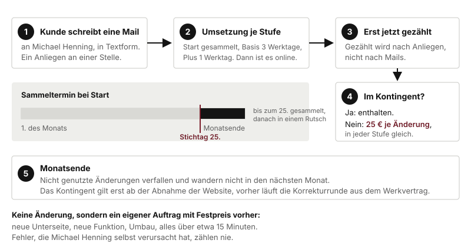

# So läuft eine Änderung

Das ist das Kapitel für die Frage, die Kunden am häufigsten stellen, sobald sie Hosting buchen: "Und wenn ich was geändert haben will?"

## Was eine Änderung ist

**Eine Änderung ist ein Anliegen an einer Stelle der Website, mit einem Aufwand von bis zu etwa 15 Minuten.**

Beispiele, die eine Änderung sind:

- neue Öffnungszeiten
- ein geänderter Preis auf der Leistungsliste
- ein neuer oder geänderter Absatz
- ein getauschtes Bild
- eine neue Telefonnummer, eine neue Mailadresse
- ein Hinweis auf Betriebsferien

Beispiele, die **keine** Änderung sind, sondern ein eigener Auftrag mit Festpreis vorher:

- eine neue Unterseite
- eine neue Funktion, zum Beispiel ein Newsletter
- ein Umbau, etwa ein Bereich neu gestaltet (bei Plus zweimal im Jahr enthalten)
- alles, was länger als etwa 15 Minuten dauert

Drei Regeln zur Zählung:

1. **Gezählt wird nach Anliegen, nicht nach Mails.** Eine Mail mit zehn Punkten sind zehn Änderungen. Eine Mail mit einem Punkt ist eine.
2. **Gezählt wird erst, wenn die Änderung umgesetzt ist.** Was in der Warteschlange steht, zählt noch nicht.
3. **Fehler, die ich selbst verursacht habe, zählen nie.** Das ist keine Änderung, das ist meine Nacharbeit.

## Der Ablauf

**1. Der Kunde schreibt eine Mail an mich.** In Textform, also Mail. Kein Anruf, keine Sprachnachricht, damit wir beide nachlesen können, was gewünscht war. An welche Adresse, sage ich dem Kunden nach der Unterschrift. Sie müssen keine nennen.

**2. Ich setze um, im Rhythmus der Stufe.**

| Stufe | Umsetzung |
|---|---|
| Start | Ich sammle. Was bis zum **25. des Monats** bei mir ist, setze ich in den letzten Werktagen des Monats in einem Rutsch um. Was nach dem 25. kommt, wandert in den nächsten Monat und zählt zu dessen Kontingent. |
| Basis | Jede Änderung innerhalb von **3 Werktagen** ab Eingang. |
| Plus | Jede Änderung innerhalb von **1 Werktag** ab Eingang. |

Der Sammeltermin ist der Grund, warum Start so günstig ist: einmal im Monat an die Seite statt bei jeder Mail.

**3. Nach der Umsetzung wird gezählt.** Der Kunde sieht die Änderung online, dann geht sie ins Kontingent.

**4. Im Kontingent oder darüber?** Innerhalb der drei, fünf oder zehn Änderungen ist sie enthalten. Jede Änderung darüber hinaus kostet **25 €**, in jeder Stufe gleich. Wie die 25 € abgerechnet werden, ob mit der nächsten Hosting-Rechnung oder gesondert, kläre ich mit dem Kunden. Sagen Sie dazu nichts Genaueres als "25 € je weitere Änderung".

**5. Am Monatsende verfallen nicht genutzte Änderungen.** Sie wandern nicht in den nächsten Monat. Wer im März nur eine von fünf braucht, hat im April wieder fünf, nicht neun.

## Umbau bei Plus

Ein Umbau ist mehr als eine Änderung: bis zu drei Stunden Arbeit, etwa ein Bereich der Seite neu gestaltet. Bei Plus sind zwei im Jahr enthalten. Der Kunde fragt ihn per Mail an, ich kläre den Umfang mit ihm. Die Grenzen:

- der erste Umbau frühestens nach sechs bezahlten Monaten
- danach einer je Halbjahr
- nicht genutzte Umbauten verfallen
- im Gratisquartal gibt es keinen

## Wann das Kontingent beginnt

**Ab der Abnahme der Website.** Zwischen Fertigstellung und Abnahme gibt es eine Korrekturrunde aus dem Werkvertrag, die nichts mit dem Hosting zu tun hat. Danach läuft das Kontingent der gebuchten Stufe.

## Was Sie dem Kunden sagen

> "Sie schreiben Herrn Henning eine Mail, was sich ändern soll. Bei Basis ist das innerhalb von drei Werktagen online, bei Start gesammelt zum Monatsende. Drei, fünf oder zehn solcher Änderungen im Monat sind im Preis drin, jede weitere kostet 25 €. Eine Änderung ist ein Anliegen an einer Stelle, also die Öffnungszeiten, ein Preis, ein Bild. Etwas Größeres wie eine neue Seite ist ein eigener kleiner Auftrag mit Festpreis vorher."

Was Sie **nicht** sagen: dass er selbst ändern kann (gibt es noch nicht), dass es "unbegrenzt" ist (keine Stufe ist unbegrenzt), oder eine konkrete Uhrzeit oder einen Tag, an dem ich etwas umsetze.
