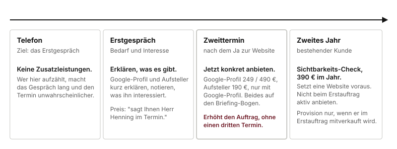

# Zusatzleistungen

Drei Leistungen, die zur Website dazukommen, aber kein Ersatz für sie sind. Ihr Wert für Sie: **sie erhöhen den Auftrag im selben Termin**, und Ihre 35 % gelten auch darauf.

## 1. Google-Unternehmensprofil

**Was es ist.** Der Eintrag, der rechts erscheint, wenn jemand den Betrieb bei Google sucht, und der Punkt auf der Karte. Mit Öffnungszeiten, Leistungen, Fotos und Bewertungen.

**Was der Betrieb davon hat.** Für Laufkundschaft und für alle, die am Handy "Schlosser in meiner Nähe" suchen, bringt dieser Eintrag oft mehr als die Website. Wer dort nicht auftaucht, existiert für diese Suchen nicht.

**Zwei Stufen:**

| | Preis | Was drin ist |
|---|---|---|
| Einrichten | 249 € | Eintrag anlegen oder übernehmen, Kategorien, Öffnungszeiten, Leistungen, Fotos |
| Einrichten und ausbauen | 490 € | wie oben, dazu Feinarbeit an Kategorien und Beschreibung und vier fertig vorbereitete Beiträge, die der Betrieb danach selbst weiterpflegt |

**Braucht keine Website.** Lässt sich auch an Betriebe verkaufen, die gerade keine wollen.

So sprechen Sie es an:

> "Haben Sie Ihren Google-Eintrag schon mal selbst angeschaut? Bei vielen Betrieben stehen da noch die Öffnungszeiten von vor drei Jahren, oder der Eintrag gehört noch dem Vorbesitzer. Das lässt sich in Ordnung bringen, und für Laufkundschaft bringt das oft mehr als die Website."

## 2. Bewertungs-Aufsteller mit QR-Code

**Was es ist.** Ein Aufsteller für den Tresen, dazu Aufkleber und ein Beileger für Rechnungen, alle mit einem Code. Wer ihn mit dem Handy scannt, landet direkt beim Bewertungsformular.

**Was der Betrieb davon hat.** Die meisten zufriedenen Kunden bewerten nie, weil es umständlich ist. Wer den Code hinstellt, bekommt mehr Bewertungen, und wer mehr Bewertungen hat, steht bei Google weiter oben.

**190 €.** Dazu kommen die Druckkosten, etwa 15 bis 30 €, die der Betrieb direkt bei der Druckerei zahlt. Das sagen Sie dazu, damit es später keine Überraschung gibt.

**Braucht keine Website, aber ein Google-Unternehmensprofil.** Beides zusammen zu verkaufen ergibt deshalb Sinn.

So sprechen Sie es an:

> "Wie viele Bewertungen haben Sie bei Google? Und wie viele zufriedene Kunden hatten Sie letzten Monat? Der Unterschied liegt fast nie an der Zufriedenheit, sondern daran, dass es keiner macht, wenn man ihn nicht dran erinnert."

**Zwei Dinge, die hier nie gesagt werden:**

- **Kein Liefertermin unter zwei Wochen.** Die Aufsteller werden je Bestellung gedruckt. Zwei Wochen als Rahmen nennen, geliefert wird meist früher. Das ist die einzige Lieferzeit, die Sie überhaupt nennen dürfen.
- **Nie versprechen, dass nur zufriedene Kunden bei Google landen.** Es gibt Anbieter, die erst nach der Zufriedenheit fragen und nur die Guten weiterleiten. Das verstößt gegen Googles Richtlinien und kann den Betrieb sein ganzes Profil kosten. Bei dekaru zeigt der Code für alle auf dasselbe Ziel. Wenn ein Betrieb ausdrücklich danach fragt: "Das machen manche, und es ist gegen die Regeln von Google. Wenn das auffällt, ist der Eintrag weg. Wir machen das nicht."

**Keine Muster zeigen.** Der Aufsteller wird erst gebaut, wenn ihn jemand bestellt. Sprechen Sie über die Wirkung, nicht über das Aussehen.

## 3. Sichtbarkeits-Check

**Was es ist.** Einmal im Jahr prüfe ich, ob die Website noch auffindbar ist, wie schnell sie lädt, ob Links ins Leere gehen und ob der Google-Eintrag noch stimmt. Die wichtigsten Punkte setze ich gleich um, der Betrieb bekommt einen Bericht auf zwei Seiten, ohne Fachbegriffe.

**Was der Betrieb davon hat.** Websites verfallen leise. Ein Link, der nicht mehr geht, fällt dem Inhaber nie auf, dem Besucher schon.

**390 € je Jahr.** Setzt als einzige der drei Leistungen eine Website voraus.

**Nicht beim Erstauftrag ansprechen.** Das ist die Leistung für das zweite Jahr, bei einem Betrieb, der schon Kunde ist. Steht deshalb auch nicht auf dem Briefing-Bogen.

## Wann Sie was ansprechen

**Am Telefon: nichts davon.** Am Telefon geht es um das Erstgespräch, sonst nichts. Wer dort Zusatzleistungen aufzählt, macht das Gespräch lang und den Termin unwahrscheinlicher.

**Im Erstgespräch: erklären, was es gibt.** Google-Profil und Aufsteller gehören zum Bild, das der Betrieb von dekaru bekommt. Notieren Sie, was ihn interessiert. Preise nennen Sie in Stufe 1 nicht, in Stufe 2 den Listenpreis.

**Im Zweittermin: nach der Website.** Erst ist klar, ob und was gebaut wird. Danach passt die Frage nach dem Google-Eintrag von selbst, weil ohnehin über Auffindbarkeit gesprochen wurde. Was der Kunde will, kommt auf den Briefing-Bogen.

**Was Sie nicht kennen, sagen Sie nicht zu.** Fragt ein Betrieb nach etwas, das hier nicht steht:

> "Das weiß ich nicht sicher, und ich will Ihnen nichts Falsches sagen. Das klären wir mit Herrn Henning."

## Was das für Ihre Provision bedeutet

| | Preis | Ihre 35 % |
|---|---|---|
| Website allein | 1.500 € | 525 € |
| Website plus Google-Profil (249 €) und Aufsteller (190 €) | 1.939 € | 678,65 € |

Rund 150 € mehr für zwei Fragen im selben Termin. Deshalb lohnt es sich, den Google-Eintrag immer anzusprechen, auch wenn der Betrieb nicht danach fragt.
