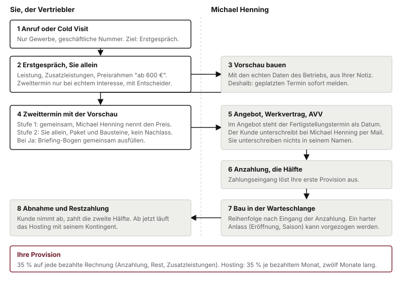

# Ablauf und Rollen

Sie sind **Vertriebler**, kein Terminierer. Sie sprechen Betriebe an, erklären, was dekaru macht, führen das Erstgespräch und später den Zweittermin mit der Vorschau. Rechtlich sind Sie selbstständiger Handelsvertreter nach § 84 HGB, auf Provision, ohne Vorgaben zu Zeiten oder Quoten, mit anderen Auftraggebern, wenn Sie wollen.

## Der Weg vom Anruf bis zur Rechnung

**1. Anruf oder Cold Visit.** Nur Gewerbetreibende, nur unter der geschäftlichen Nummer, mit klarem Anlass (Kapitel 7). Cold Visits, also unangemeldete Besuche im Betrieb, sind in Ihrem ganzen Gebiet erlaubt, nicht nur im Kernradius. Ziel ist das Erstgespräch mit dem Inhaber.

**2. Erstgespräch, Sie allein.** Sie erklären, was der Betrieb bekommt, welche Zusatzleistungen es gibt und welcher Preisrahmen gilt: "ab 500 €". Sie nehmen auf, was ihn an seiner jetzigen Lage stört. Ein Zweittermin wird nur vereinbart, wenn das Interesse echt ist, denn für jeden Zweittermin baue ich eine Vorschau. Echt heißt:

- Der Inhaber hat selbst gesagt, was ihn stört.
- Er kennt den Preisrahmen und hat nicht abgewunken.
- Er weiß, welche Zusatzleistungen ihn interessieren.
- Der Entscheider sitzt beim Zweittermin mit am Tisch.

Fragen Sie direkt: "Entscheiden Sie das selbst oder redet da noch jemand mit?"

**3. Ich baue die Vorschau.** Mit den echten Daten des Betriebs, aus Ihrer Notiz. Das ist Arbeit, die ich in einen Termin stecke, bevor klar ist, ob etwas daraus wird. Deshalb zwei Bitten: einen geplatzten Termin sofort melden, nicht erst im Wochenbericht. Und die Notiz aus dem Gespräch mitschicken, auch wenn sie kurz ist. Je besser die Vorschau trifft, desto eher wird daraus Ihre Provision.

**4. Zweittermin mit der Vorschau.** Vor Ort oder per Video, je nach Gebiet. Die Vorschau wird gemeinsam angeschaut, nie vorab verschickt. Sagt der Inhaber Ja, füllen Sie mit ihm den **Briefing-Bogen** aus. Rechnen Sie dafür mit zwanzig Minuten. Aus dem Bogen entstehen Angebot, Verträge und die Website. Was dort fehlt, fehlt auf der Seite.

**5. Angebot, Werkvertrag, AVV.** Kommen von mir per Mail, der Kunde unterschreibt bei mir. Im Angebot steht der **Fertigstellungstermin als Datum**, im Werkvertrag ist er verbindlich. Sie unterschreiben nichts in meinem Namen und versprechen nichts, was nach Vertrag klingt.

**6. Anzahlung.** Die Hälfte des Website-Preises bei Auftrag. Ihr erster Zahlungseingang, also Ihre erste Provision.

**7. Bau in der Warteschlange.** Aufträge werden in der Reihenfolge begonnen, in der die Anzahlung eingeht. Ein harter Anlass, etwa eine Eröffnung oder ein Saisonstart, kann vorgezogen werden. Notieren Sie ihn deshalb immer auf dem Bogen.

**8. Abnahme und Restzahlung.** Der Kunde sieht die fertige Seite, es gibt eine Korrekturrunde, er nimmt ab und zahlt die zweite Hälfte. Ab der Abnahme läuft das Hosting mit seinem Kontingent.

Ab dem Auftrag laufen Rückfragen, Freigabe und Abnahme direkt zwischen mir und dem Kunden. Sie bekommen den Ausgang gemeldet, Sie müssen nicht mehr vermitteln.

## Warteschlange statt Bauzeit

Es gibt **keine feste Bauzeit** und **kein Limit an Abschlüssen.** Sie müssen nicht bremsen, wenn viel reinkommt. Was über meine Kapazität geht, kommt in die Warteschlange. Der Betrieb erfährt seinen Termin im Angebot, bevor er unterschreibt, im Werkvertrag ist er verbindlich, und er wird gehalten.

Für Sie heißt das: **keine Bauzeit zusagen, weder Tage noch Wochen.** Nicht "das geht schnell", nicht "so zwei, drei Wochen". Die Antwort auf "Wie lange dauert das?" ist:

> "Das steht als Datum im Angebot, bevor Sie unterschreiben. Wenn Sie einen festen Anlass haben, eine Eröffnung oder eine Saison, sagen Sie es mir jetzt, dann richtet sich der Termin danach."

## Wer macht was

| Sie | Michael Henning |
|---|---|
| Betriebe recherchieren, anrufen, besuchen | Vorschau bauen |
| Erstgespräch führen, Bedarf und Entscheider klären | Angebot, Werkvertrag, AVV |
| Zweittermin führen, Vorschau zeigen | Preis nennen (Stufe 1) |
| Briefing-Bogen ausfüllen und übergeben | Website bauen, Abnahme |
| Wochenbericht schreiben | Hosting und Betreuung über Jahre |
| Zusatzleistungen ansprechen | Rückmeldung zu jedem Ausgang |

## Stufe 1 und Stufe 2

**Stufe 1: die ersten fünf Zweittermine gemeinsam.** Sie präsentieren die Vorschau, ich sitze daneben, beantworte Technikfragen und nenne den Preis. So sehe ich, was Sie versprechen, und Sie lernen die Fragen kennen, die kommen.

**Stufe 2: ab dem sechsten Zweittermin allein.** Sie präsentieren, nennen den Preis aus dem Preisrechner, gewinnen den Auftrag und füllen den Briefing-Bogen aus. Der Preis ist der Listenpreis, ohne Nachlass. Was nicht im Preisrechner steht, klären Sie mit mir, es kommt als Nachtrag ins Angebot.

Was in beiden Stufen bei mir bleibt: Angebot, Verträge, Unterschrift, Rückfragen während des Baus, Abnahme, Hosting.

## Vor Ort oder per Video

Beide Termine sind gleich viel wert. Welcher gilt, hängt am Ort des Betriebs:

| Zone | Was möglich ist | Ortsbezug |
|---|---|---|
| Kernradius, Raum Horb am Neckar und Nagold | Vor-Ort-Termin und Video | "aus Horb", "hier aus der Gegend" erlaubt |
| Bahn-Gebiet, Orte an der Gäubahn | Vor-Ort-Termin und Video | kein "aus der Gegend" |
| Überregional | nur Video | kein Ortsbezug, "Büro in Baden-Württemberg, gearbeitet wird online" |

Ein Video-Termin ist kein Termin zweiter Klasse. Zwanzig Minuten am Bildschirm sagt fast jeder zu.

**Ihr Gebiet** ist eine Liste aus Städten und Landkreisen, die ich beim Aufsetzen mit Ihnen festlege. Dort ruft niemand sonst an, und ein Betrieb, den Sie bearbeitet haben, bleibt Ihrer, auch wenn der Abschluss Monate später kommt. Betriebe außerhalb melden Sie mir, ich ordne sie zu.

**Cold Visits im ganzen Gebiet.** Unangemeldet im Betrieb vorbeizugehen ist überall in Ihrem Gebiet erlaubt, egal welche Zone. Was auf den Kernradius beschränkt bleibt, ist nur der Satz zur Nähe: "Michael Henning sitzt in Horb, ein Termin bei Ihnen im Betrieb geht ohne zwei Wochen Vorlauf." Außerhalb des Kernradius ist das nicht wahr, und erfundene Nähe fliegt im Termin auf.

## Der Wochenbericht

Einmal pro Woche, freitags bis 18 Uhr, formlos per Mail. Zahlen (angerufen, erreicht, Termine, geplatzt, Wiedervorlagen, Sperrvermerke), die offene Pipeline mit Stand je Betrieb, und ein Abschnitt "Was aufgefallen ist". Der letzte ist der wichtigste: kommt dreimal in einer Woche derselbe Einwand, stimmt etwas am Skript oder an meiner Vorschau. Das sehe ich nur, wenn Sie es aufschreiben.

In die Notiz gehört, was **er** gesagt hat, nicht was Sie gesagt haben: Zustand der Seite, wer sie gebaut hat, was ihn konkret stört, wann er Zeit hat.

## Was ich Ihnen zusage

Sie liefern das Gespräch und sehen danach nicht alles, was passiert. Deshalb:

- **Ich melde jeden Ausgang zurück**, Abschluss wie Absage, innerhalb einer Woche nach dem Zweittermin. Bei einer Absage mit dem Grund, so wie der Betrieb ihn genannt hat, auch wenn er bei mir liegt.
- **Bei einem Abschluss** bekommen Sie Projektpreis, Zahlungsvereinbarung und den Zeitpunkt, an dem mit Ihrer Provision zu rechnen ist.
- **Monatlich zum Fünften** eine Abrechnung mit einer Aufstellung je Abschluss, aus der hervorgeht, welcher Termin welchen Betrag ergeben hat.

Bleibt die Rückmeldung aus, fragen Sie nach. Das ist Teil der Abmachung, keine Freundlichkeit.

## Der Briefing-Bogen: drei Regeln

1. **Nur ankreuzen, was auf der Preisliste steht.** Alles andere kommt als Sonderwunsch auf den Bogen, ohne Zusage und ohne Preis.
2. **Keine Passwörter, keine Zugangsdaten auf den Bogen.** Nicht auf Papier, nicht per Mail, nicht per Messenger. Die kläre ich direkt mit dem Kunden.
3. **Was Sie versprochen haben, steht wörtlich auf dem Bogen.** Das schützt Sie, den Kunden und die Provision.

Übergabe auf dem Weg, den wir vereinbaren. Nicht per WhatsApp, nicht als Foto in einer Gruppe. Danach keine Kopie behalten: Papier vernichten, Datei löschen. Die Kundendaten liegen ab jetzt bei mir.
