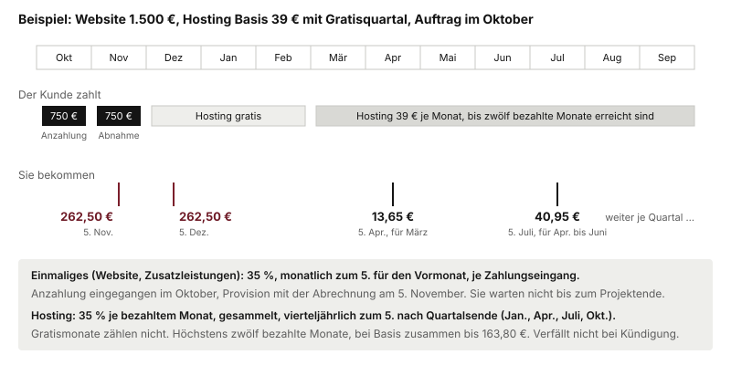

# Provision

**35 % vom Projektumsatz.** Kein Fixum, keine Terminpauschale. Bezahlt wird, wenn der Kunde bezahlt hat, nicht wenn er unterschrieben hat. Der Grund ist einfach: solange der Kunde nicht gezahlt hat, habe ich auch nichts.

| | |
|---|---|
| Provision | 35 % auf alles Einmalige auf der Rechnung |
| Fällig | nach Zahlungseingang beim Kunden |
| Abrechnung | monatlich zum Fünften für den Vormonat, mit Aufstellung je Abschluss |
| Teilzahlungen | anteilig, in derselben Aufteilung |
| Hosting | 35 % auf die ersten zwölf bezahlten Monate, vierteljährlich ausgezahlt |
| Zuordnung | ein Abschluss zählt zu dem, der das Erstgespräch geführt hat, auch Monate später |

Ich bin Kleinunternehmer und weise keine Umsatzsteuer aus. Rechnungsbetrag und Umsatz sind dieselbe Zahl. Steht auf der Rechnung 1.200 €, sind das 420 € für Sie. Es gibt keine Grundlage für Streit darüber, worauf gerechnet wird.

## Worauf gerechnet wird

Auf alles Einmalige, das auf der Rechnung steht: der Website-Preis **und die Zusatzleistungen** Google-Profil, Aufsteller, Sichtbarkeits-Check.

| | Preis | Ihre 35 % |
|---|---|---|
| Website allein | 1.500 € | 525 € |
| Website plus Google-Profil (249 €) und Aufsteller (190 €) | 1.939 € | 678,65 € |

## Provision auf Hosting

Seit dem 29.09.2026 gibt es auch auf Hosting Provision: **35 % auf die ersten zwölf bezahlten Monate.** Gerechnet wird auf das, was der Kunde tatsächlich zahlt. Gratismonate zählen nicht mit.

| Tarif | je bezahltem Monat | höchstens (12 Monate) | bei Jahreszahlung |
|---|---|---|---|
| Start, 19 € | 6,65 € | 79,80 € | 66,50 € auf einmal |
| Basis, 39 € | 13,65 € | 163,80 € | 136,50 € auf einmal |
| Plus, nur jährlich 590 € | entfällt | entfällt | 206,50 € auf einmal |

Die Hosting-Provision entsteht mit jeder bezahlten Hosting-Rechnung und **verfällt nicht**, auch wenn der Kunde später kündigt. Sie wird gesammelt und **vierteljährlich ausgezahlt**, mit der Abrechnung zum Fünften nach Quartalsende: im Januar, April, Juli und Oktober. Bei Jahreszahlung kommen 35 % der Jahresrechnung auf einmal, mit der nächsten Quartalsabrechnung nach Zahlungseingang.

Bei einem Kunden mit Gratisquartal entsteht die erste Hosting-Provision im vierten Monat nach Abnahme und kommt mit der nächsten Quartalsabrechnung.

## Wann das Geld kommt

**Bei Teilzahlungen anteilig.** Zahlt ein Kunde die Hälfte an und den Rest bei Übergabe, bekommen Sie die Provision in derselben Aufteilung. Die erste Hälfte kommt mit der Abrechnung des Monats, in dem die Anzahlung eingegangen ist. Sie warten nicht bis zum Projektende.

**Zahlt ein Kunde nicht, gibt es auf den offenen Teil keine Provision.** Zurückgefordert wird eine ausgezahlte Provision nur, wenn eine bereits bezahlte Rechnung storniert und das Geld zurückerstattet wird. Dann verrechne ich den Betrag mit der nächsten Abrechnung.

## Drei Rechenbeispiele

**Beispiel 1: der erste Abschluss, mit Anzahlung.** Ein Betrieb beauftragt für 700 €. Die Hälfte bei Auftrag, die Hälfte bei Übergabe.

| Zeitpunkt | Zahlung des Kunden | Ihre Provision |
|---|---|---|
| Auftrag, Anzahlung | 350 € | 122,50 € |
| Übergabe, Restzahlung | 350 € | 122,50 € |
| **Zusammen** | **700 €** | **245 €** |

**Beispiel 2: ein guter Monat.** Drei Abschlüsse aus Gesprächen der Vormonate, alle vollständig bezahlt.

| Projekt | Preis | 35 % |
|---|---|---|
| Einfache Seite (S) | 700 € | 245 € |
| Normalfall (M) | 1.200 € | 420 € |
| Mit Zusatzbausteinen (L) | 1.900 € | 665 € |
| **Zusammen** | **3.800 €** | **1.330 €** |

Alle drei Betriebe haben zusätzlich Hosting Basis gebucht, mit Gratisquartal. Das steht nicht in der Tabelle, weil es später kommt: je bezahltem Monat und Betrieb 13,65 €, vierteljährlich ausgezahlt, über zwölf Monate zusammen bis zu 491,40 €.

**Beispiel 3: wenn es schiefgeht.** Ein Kunde beauftragt für 1.200 €, zahlt 600 € an und dann nicht weiter. Die Seite ist gebaut, die Schlussrechnung bleibt offen, am Ende storniere ich sie.

| Vorgang | Betrag | Ihre Provision |
|---|---|---|
| Anzahlung eingegangen | 600 € | 210 €, ausgezahlt |
| Schlussrechnung offen | 600 € | 0 € |
| Storno der Schlussrechnung | | keine Rückforderung |
| **Zusammen** | **600 €** | **210 €** |

Was der Kunde bezahlt hat, bleibt bei Ihnen.

## Wenn ich die Preise erhöhe

Meine Preise werden steigen. Damit steigt die Grundlage für Ihre 35 %, und irgendwann passt der Prozentsatz nicht mehr. Der Grundsatz, auf den Sie sich verlassen können: **wenn ich den Prozentsatz anpasse, sinkt der Betrag je Abschluss nicht.** Beispiel: heute 900 € Projekt, 35 %, also 315 €. Steigt der Preis für dasselbe Projekt auf 1.200 € und der Satz auf 30 %, sind das 360 €, jedenfalls nicht weniger als 315 €. Die genaue Regelung steht im Vertrag.

## Ehrlich zum Anlauf

Ohne Pauschale verdienen Sie nichts, bis der erste Kunde bezahlt hat. Realistisch liegen zwischen Ihrem ersten Anruf und Ihrem ersten Geld **sechs bis zehn Wochen**: Erstgespräch, Vorschau, Zweittermin, Entscheidung, Anzahlung, Abrechnung zum Fünften.

Das ist der Preis für die 35 %. Handelsvertreter bekommen je nach Branche üblicherweise 5 bis 20 %. Ein Modell mit Terminpauschale zahlt früher und deutlich weniger je Abschluss.

Was das in Zahlen heißt: bei einem Projekt um 900 € und einer Quote von einem Drittel bringt jeder Zweittermin im Schnitt rund 105 €. Zwölf Zweittermine im Monat sind dann etwa 1.260 €, aber eben zeitversetzt. Rechnen Sie mit dem Anlauf, dann trägt das Modell. Rechnen Sie ihn weg, wird es im zweiten Monat unangenehm.
